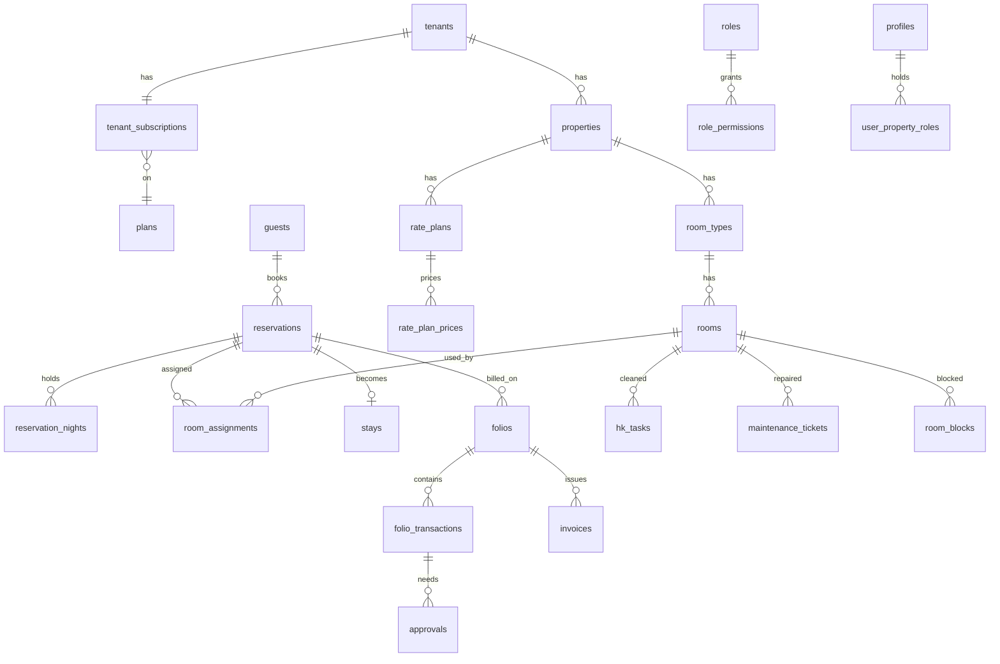

# HMS data model

Supabase Postgres. Migrations in `supabase/migrations`. Tests in `supabase/tests`.
Lovable builds the UI only. It never changes the schema.

## Rules the database enforces

- **Tenant isolation.** Every business table has `tenant_id`. Row-level security limits each row to the caller's tenant. Property-scoped tables also check property access.
- **Permissions.** Each RPC checks a permission key. Grant level is Y (any), L (up to a limit in `approval_limits`) or O (own records). L with no limit row means 0.
- **Immutable ledger.** `folio_transactions` rows are never updated or deleted. A trigger blocks it. A correction is a new linked row: reversal, adjustment or refund. Balances come from `v_folio_balances`.
- **Approvals.** Adjustments, reversals and refunds always need approval. A discount above the user's limit waits for approval. The approver must differ from the requester (DB check).
- **Idempotency.** `idempotency_key` is unique per tenant. A retry returns the first result. Room charges use `room:<reservation>:<date>`.
- **Availability.** `reservation_nights` holds one row per night. An advisory lock per property and room type serialises bookings. A GiST exclusion constraint `no_overlapping_room_use` stops a room being used twice.
- **Room state.** Condition (clean, dirty, inspected), occupancy and sellability are separate. A room can be sold only if it is not blocked and not out of order.
- **Business date.** `app.run_due_rollovers()` rolls each property's date automatically. A failed roll notifies managers and changes nothing.
- **Subscriptions.** `app.run_subscription_clock()` moves trial to expired, lapsed active to past_due, and past_due over 14 days to suspended. Read-only tenants can still settle and check out.
- **Plan limits.** Triggers cap rooms, properties and users by plan.
- **Default deny.** The browser role reads through RLS, writes a few configuration tables with column limits, and calls `public` functions. Everything else is closed. Helpers live in schema `app` and are not callable.

## Tables

### Platform and identity

| Table | Columns |
|---|---|
| `tenants` | 6 |
| `plans` | 11 |
| `tenant_subscriptions` | 7 |
| `subscription_events` | 8 |
| `platform_staff` | 2 |
| `profiles` | 7 |
| `permissions` | 5 |
| `roles` | 8 |
| `role_permissions` | 3 |
| `user_property_roles` | 7 |
| `approval_limits` | 6 |
| `audit_events` | 12 |
| `notifications` | 11 |
| `notification_outbox` | 11 |

### Property setup

| Table | Columns |
|---|---|
| `properties` | 16 |
| `country_templates` | 9 |
| `currencies` | 3 |
| `exchange_rates` | 9 |
| `tax_rates` | 14 |
| `charge_codes` | 9 |
| `payment_methods` | 7 |
| `document_sequences` | 4 |
| `room_types` | 14 |
| `rooms` | 13 |
| `rate_plans` | 18 |
| `rate_plan_prices` | 11 |

### Guests and reservations

| Table | Columns |
|---|---|
| `guests` | 15 |
| `guest_documents` | 9 |
| `guest_feedback` | 11 |
| `group_bookings` | 13 |
| `reservations` | 30 |
| `reservation_guests` | 4 |
| `reservation_nights` | 9 |
| `room_assignments` | 10 |
| `stays` | 11 |

### Ledger

| Table | Columns |
|---|---|
| `folios` | 15 |
| `folio_transactions` | 26 |
| `approvals` | 17 |
| `invoices` | 17 |

### Operations

| Table | Columns |
|---|---|
| `hk_tasks` | 23 |
| `room_blocks` | 15 |
| `maintenance_tickets` | 23 |
| `service_requests` | 21 |
| `lost_found_items` | 12 |

### Business date

| Table | Columns |
|---|---|
| `business_date_log` | 9 |
| `daily_stats` | 17 |

### Views

`v_arrivals`, `v_folio_balances`, `v_hk_board`, `v_in_house`, `v_kpi_daily`, `v_room_board`, `v_transactions`

## Relationships

## Sign-up and provisioning

1. Guest signs up with Supabase Auth and confirms email.
2. The app calls `create_hotel(...)`. It creates the tenant, a 30-day trial, the first property with country defaults, and gives the user the SYS and GM roles.
3. Invited staff need an Edge Function. It creates the auth user, then calls `register_invited_user`, then `assign_role`.

## Error codes

Every failure raises `[E_CODE] message`. The UI should match on the code in brackets.

`E_ALREADY_HAS_HOTEL`, `E_ALREADY_REVERSED`, `E_AMOUNT`, `E_ARG`, `E_AUTH`, `E_BALANCE`, `E_CHARGE_CODE`, `E_CREDIT`, `E_CURRENCY`, `E_DATE`, `E_DATES`, `E_DEPOSIT`, `E_DUPLICATE`, `E_EMAIL_UNVERIFIED`, `E_ESCALATION`, `E_FOLIO_CLOSED`, `E_ID_REQUIRED`, `E_IMMUTABLE`, `E_LAST_ADMIN`, `E_LIMIT`, `E_NOT_FOUND`, `E_NO_RATE`, `E_OCCUPANCY`, `E_OVERSOLD`, `E_PAYMENT_METHOD`, `E_PENDING_APPROVAL`, `E_PERM`, `E_PLAN`, `E_PLAN_LIMIT`, `E_PRECISION`, `E_RATE_PLAN`, `E_READ_ONLY`, `E_REASON`, `E_REFUND_LIMIT`, `E_REGISTRATION`, `E_ROOM`, `E_ROOM_BLOCKED`, `E_ROOM_NOT_READY`, `E_ROOM_OCCUPIED`, `E_ROOM_TAKEN`, `E_ROOM_TYPE`, `E_SOD`, `E_STATE`, `E_STAY_LENGTH`, `E_UNAVAILABLE`, `E_UNSETTLED`

## RPC catalogue

All are in schema `public`. Call with `supabase.rpc(name, args)`.

| Function | Arguments | Returns |
|---|---|---|
| `anonymise_guest` | p_guest uuid, p_reason text | void |
| `apply_discount` | p_folio uuid, p_charge_code uuid, p_amount numeric, p_currency text, p_reason text, p_tax_inclusive boolean, p_idempotency_key text | jsonb |
| `assign_hk_task` | p_task uuid, p_user uuid | void |
| `assign_role` | p_user uuid, p_property uuid, p_role uuid | void |
| `assign_room` | p_id uuid, p_room uuid | void |
| `assign_service_request` | p_id uuid, p_user uuid, p_department text | void |
| `assign_ticket` | p_ticket uuid, p_user uuid | void |
| `cancel_hk_task` | p_task uuid, p_reason text | void |
| `cancel_reservation` | p_id uuid, p_reason text, p_waive_fee boolean | numeric |
| `cancel_service_request` | p_id uuid, p_reason text | void |
| `cancel_subscription` | p_reason text | void |
| `cancel_ticket` | p_ticket uuid, p_reason text | void |
| `check_in` | p_id uuid, p_room uuid, p_registration jsonb | uuid |
| `check_out` | p_reservation uuid, p_approval uuid | void |
| `close_folio` | p_folio uuid | void |
| `close_ticket` | p_ticket uuid | void |
| `complete_hk_task` | p_task uuid, p_checklist jsonb, p_notes text | void |
| `complete_service_request` | p_id uuid | void |
| `confirm_reservation` | p_id uuid | void |
| `create_hk_task` | p_room uuid, p_type text, p_notes text, p_priority integer | uuid |
| `create_hotel` | p_business_name text, p_country text, p_property_name text, p_full_name text, p_city text, p_plan_code text | jsonb |
| `create_property` | p_name text, p_country text, p_city text, p_address text | uuid |
| `create_reservation` | p_property uuid, p_guest uuid, p_arrival date, p_departure date, p_room_type uuid, p_rate_plan uuid, p_adults integer, p_children integer, p_source text, p_status text, p_company text, p_special text, p_notes text, p_guarantee text, p_hold_hours integer, p_rate_override numeric, p_rate_override_reason text, p_group uuid, p_idempotency_key text | uuid |
| `create_service_request` | p_reservation uuid, p_category text, p_description text, p_chargeable boolean, p_charge_amount numeric, p_currency text, p_charge_code uuid | uuid |
| `create_ticket` | p_property uuid, p_title text, p_description text, p_room uuid, p_location text, p_priority text | uuid |
| `decide_approval` | p_approval uuid, p_approve boolean, p_reason text | void |
| `extend_stay` | p_reservation uuid, p_new_departure date, p_reason text | void |
| `get_assignable_rooms` | p_property uuid, p_arrival date, p_departure date, p_room_type uuid | TABLE(room_id uuid, room_number text, room_type_id uuid, condition text, is_occupied boolean) |
| `get_availability` | p_property uuid, p_arrival date, p_departure date | TABLE(room_type_id uuid, stay_date date, sellable_rooms integer, reserved integer, available integer) |
| `inspect_hk_task` | p_task uuid, p_pass boolean, p_reason text, p_defects jsonb | void |
| `issue_invoice` | p_folio uuid, p_kind text | uuid |
| `mark_no_show` | p_id uuid, p_reason text, p_waive_fee boolean | numeric |
| `merge_guests` | p_keep uuid, p_remove uuid, p_reason text | void |
| `modify_reservation` | p_id uuid, p_arrival date, p_departure date, p_room_type uuid, p_rate_plan uuid, p_adults integer, p_children integer, p_special text, p_notes text, p_company text, p_guarantee text, p_rate_override numeric, p_rate_override_reason text | void |
| `move_room` | p_reservation uuid, p_new_room uuid, p_reason text, p_complimentary boolean | void |
| `platform_change_subscription` | p_tenant uuid, p_action text, p_reason text, p_plan_code text, p_period_end timestamp with time zone | void |
| `post_charge` | p_folio uuid, p_charge_code uuid, p_amount numeric, p_currency text, p_description text, p_tax_inclusive boolean, p_idempotency_key text, p_reference text | jsonb |
| `post_payment` | p_folio uuid, p_method uuid, p_amount numeric, p_currency text, p_reference text, p_is_deposit boolean, p_idempotency_key text | uuid |
| `register_invited_user` | p_user uuid, p_full_name text, p_phone text | void |
| `reinstate_reservation` | p_id uuid, p_reason text | void |
| `release_room_block` | p_block uuid, p_reason text | void |
| `remove_role` | p_user uuid, p_property uuid, p_role uuid | void |
| `reopen_folio` | p_folio uuid, p_reason text | void |
| `reopen_ticket` | p_ticket uuid, p_reason text | void |
| `request_adjustment` | p_folio uuid, p_direction text, p_amount numeric, p_currency text, p_description text, p_reason text | uuid |
| `request_refund` | p_folio uuid, p_method uuid, p_amount numeric, p_currency text, p_reason text, p_reference text | uuid |
| `request_reversal` | p_txn uuid, p_reason text | uuid |
| `request_room_block` | p_room uuid, p_type text, p_from date, p_to date, p_reason text, p_ticket uuid | uuid |
| `request_unsettled_checkout` | p_reservation uuid, p_reason text | uuid |
| `resolve_ticket` | p_ticket uuid, p_note text | void |
| `search_guests` | p_query text, p_limit integer | SETOF guests |
| `set_arrival_ready` | p_id uuid, p_ready boolean | void |
| `set_exchange_rate` | p_property uuid, p_currency text, p_date date, p_rate numeric | void |
| `set_reservation_guests` | p_id uuid, p_guests uuid[] | void |
| `set_room_condition` | p_room uuid, p_condition text, p_reason text | void |
| `set_user_status` | p_user uuid, p_status text, p_reason text | void |
| `split_folio` | p_reservation uuid, p_label text | uuid |
| `start_hk_task` | p_task uuid | void |
| `start_service_request` | p_id uuid | void |
| `start_ticket` | p_ticket uuid | void |
| `transfer_transaction` | p_txn uuid, p_to_folio uuid, p_reason text | void |
| `unassign_room` | p_id uuid | void |
| `undo_checkout` | p_stay uuid, p_reason text | void |
| `void_check_in` | p_stay uuid, p_reason text | void |
| `wait_ticket` | p_ticket uuid, p_reason text | void |
| `walk_in_check_in` | p_property uuid, p_guest uuid, p_departure date, p_room uuid, p_rate_plan uuid, p_adults integer, p_children integer, p_registration jsonb, p_rate_override numeric, p_rate_override_reason text, p_idempotency_key text | uuid |
| `withdraw_approval` | p_approval uuid | void |

## Known gaps

See the Build Gaps sheet in `HMS_R1_Requirements.xlsx`.
