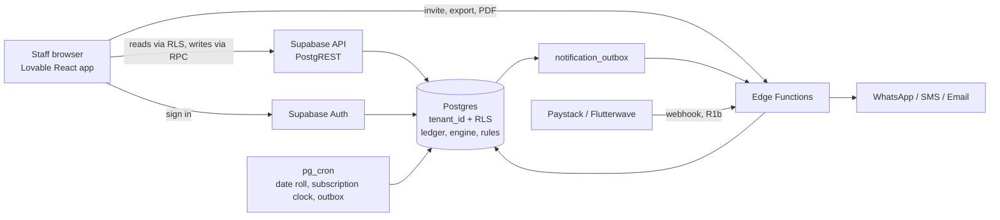

# HMS system design

Version 0.1, 28 Sep 2026. Covers R1 and the path to R2.

## Principle

Put the rules in the database. The UI is a thin client. Money and room inventory must stay correct when the UI has bugs. The ledger, approvals, availability and permissions live in Postgres and are tested there.

## Architecture

## Layers

| Layer | Choice | Job |
|---|---|---|
| Client | Lovable React, on Vercel or Lovable hosting | Screens and form checks only. Calls Supabase only. |
| API | PostgREST and public RPC functions | Reads filtered by RLS. Every write is an RPC. |
| Edge Functions | Supabase | Staff invite, webhooks, message sending, PDF, exports. |
| Data | One Postgres, shared schema | `tenant_id` on every row. RLS isolates tenants. |
| Jobs | pg_cron | Date roll every 5 min. Subscription clock daily. Outbox every minute. |
| Auth | Supabase Auth, email confirmed | Roles and permissions come from tables, not the JWT. A change applies at once. |

## Decisions

- **Shared schema, not a database per hotel.** Cheaper and one migration path. Tests prove isolation. A large chain can move to its own database later.
- **Immutable ledger.** Corrections are linked reversal, adjustment or refund rows. Balances are derived in views.
- **Idempotency keys** on every money and inventory write. Retries on weak networks never double charge.
- **Night rows plus an exclusion constraint** stop double booking, even under concurrent requests.
- **Payments taken outside the system in R1.** Staff record them. No payment licence question, faster launch.
- **Online only in R1.** Client ids and idempotency keys keep offline possible.

## Security

- Default deny grants. The browser role calls `public` functions only.
- Separation of duties: approver differs from requester. Inspector differs from cleaner. Ticket closer differs from resolver.
- Audit events on sensitive actions.
- Backups: point-in-time recovery on the paid tier. Test one restore before go-live.
- Data protection: get advice on holding Nigerian guest data in Frankfurt before signing a bank or chain.

## Scale

- One Postgres is enough for hundreds of hotels.
- First pressure points are `folio_transactions` and reports. Partition transactions by month near 50 million rows. Serve reports from a replica.
- Keep hot queries on `(tenant_id, property_id, date)` indexes.

## Integrations, in order

1. Paystack or Flutterwave for subscription billing (R1b).
2. WhatsApp and SMS confirmations.
3. Channel manager for OTAs (R3).
4. Accounting export to a general ledger.

## Environments and release

- Local, staging, production.
- Migrations reach Supabase only through `supabase db push` from CI, after the test suite passes.
- Alerts: failed date roll, outbox backlog, error rate in the UI.

## Next build items

| Item | Why | Work |
|---|---|---|
| Outbox dispatcher | Confirmations and alerts do not send yet. | Edge Function reads `notification_outbox`, sends, marks sent or failed, retries with back-off. Cron every minute. |
| Break-glass access | Support needs time-boxed access with a tenant notice. Build before the first paying hotel. | Table for grants with reason and expiry. RPC to request and end. RLS clause. Audit entry. Notice to tenant admins. |
| Staff invite function | Staff cannot be added from the UI yet. | Edge Function creates the auth user, then `register_invited_user`, then `assign_role`. |
| Exports | Required by BR-020. | Export Edge Function with permission check and audit entry. |
| Report views | Cancellation rate, ALOS, outstanding balances. | Three views and tests. |
| Front desk offline mode | Power and network cuts. | R2. Queue writes with client ids, replay with idempotency keys. |

## Top risks

- Tax and fee seed is unverified. Accountant sign-off needed.
- Data residency rules.
- Network and power at the front desk.
- One builder. Keep the test suite green.
